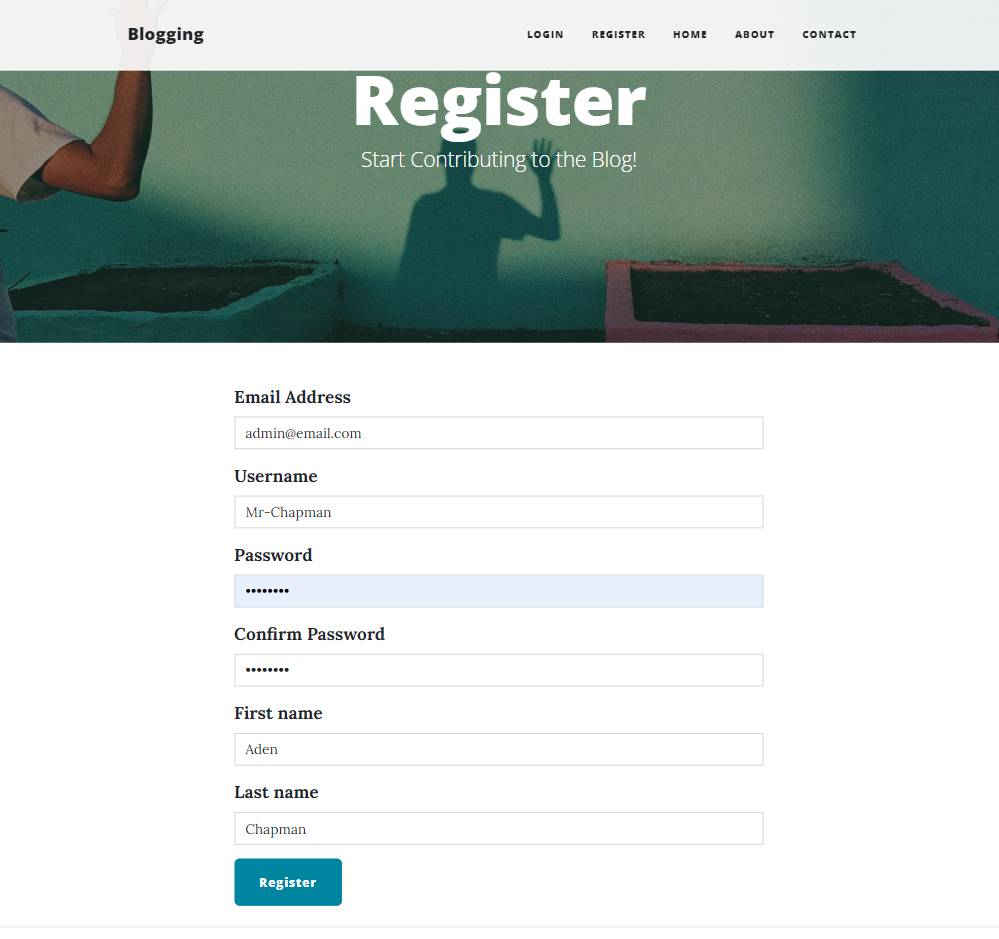
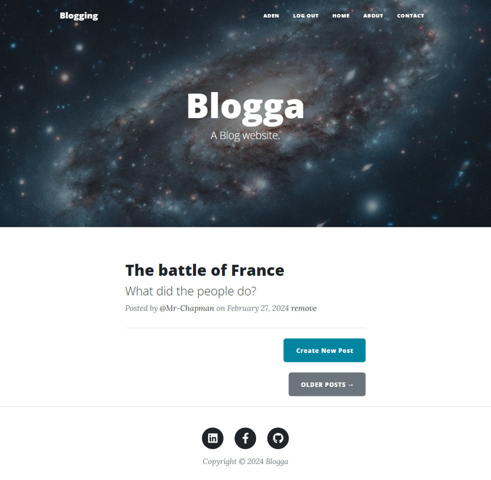
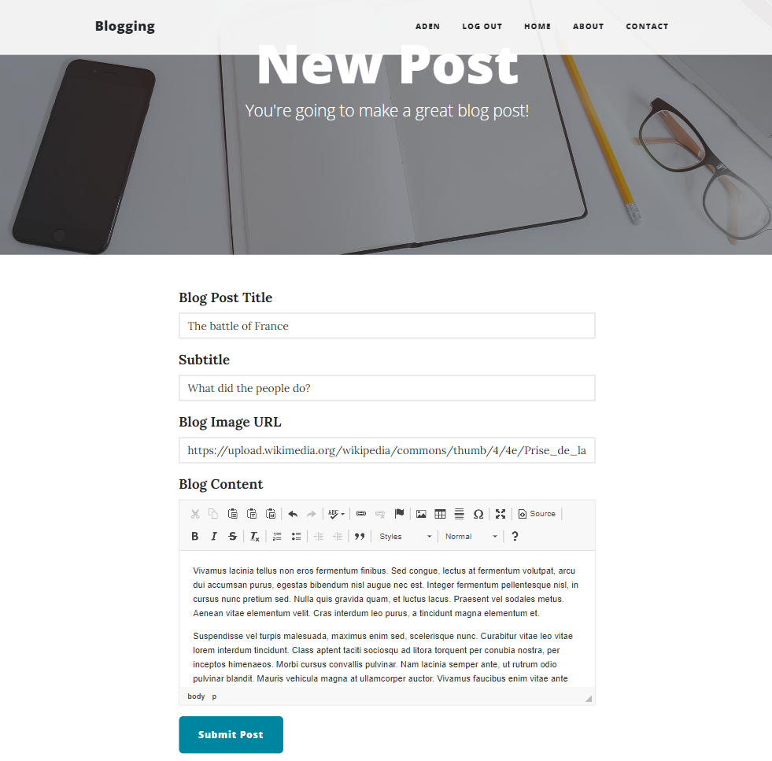
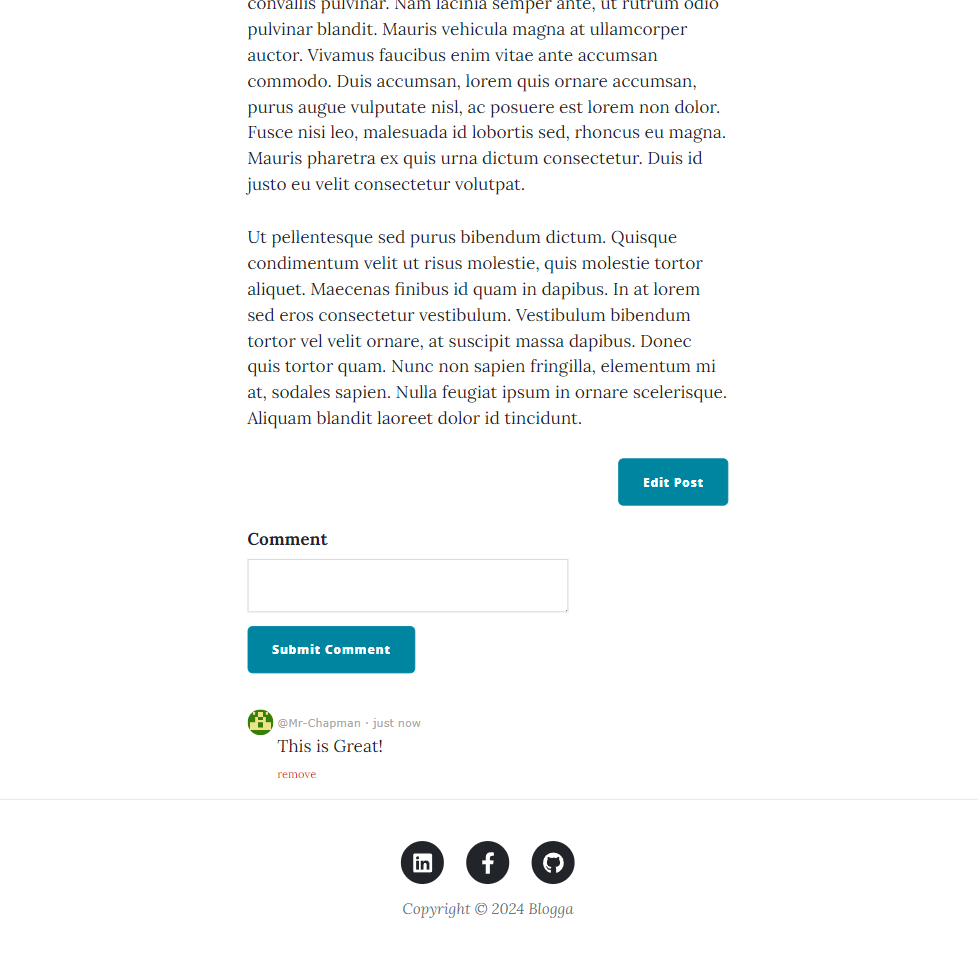

# Blogga-app

## Description
Blogga-app is a web application designed for creating blog posts. It is built using Flask, a Python web framework, and utilizes SQL for database management and Flask-Auth for authentication.

The App is coded using Python (Flask Framework), uses a SQL database (SQLAlchemy), Bootstrap 5 (CSS Framework).

## Features
- User authentication and registration, Utilisation of Bcrypt
- Create, Read, Update and delete blog posts (CRUD)
- Comment system with timestamps for interaction
- Responsive web design using Bootstrap 5 CSS
- Flash messaging for a positive user experience.
- Object Oriented Programming used to create Database models and user input forms.

## Live Screen Shots

1. **User Registration and Login**: Users can register as new users or log in. This process is secured using Bcrypt for hashing passwords, ensuring enhanced security.  

    

2. **Access to Content Feed**: Authorised users access the applications ability to create, update, and delete their own blog posts. Non-authorised users may also read blog posts by others, fostering a community of shared information.  

      

3. **Creating a Blog Post**: Users can create blog posts using a form which supports advanced formatting options with CKEditor, allowing for rich text editing and versatile content creation.  

      

4. **Interactive Comments**: Users, including the original author of a blog post, can comment on posts, adding a layer of interaction. Comments include detailed timestamps, providing context and sequence to discussions.  

      

## Installation
To set up the Blogga-app on your local machine, follow these steps:
1. Clone the repository: `git clone https://github.com/chapmanic/Blogga-app.git`
2. Install dependencies: `pip install -r requirements.txt`
3. Initialize the database: `python init_db.py`
4. Run the application: `python app.py`

## Usage
After installation, visit `http://localhost:5000` in your web browser to start using the app.

## Contributing
Contributions to the Blogga-app are welcome. Please fork the repository and submit a pull request for review.

## License
This project is licensed under the [MIT License](LICENSE).

## Contact
For any inquiries, please contact aden@accessmycare.co.uk.

